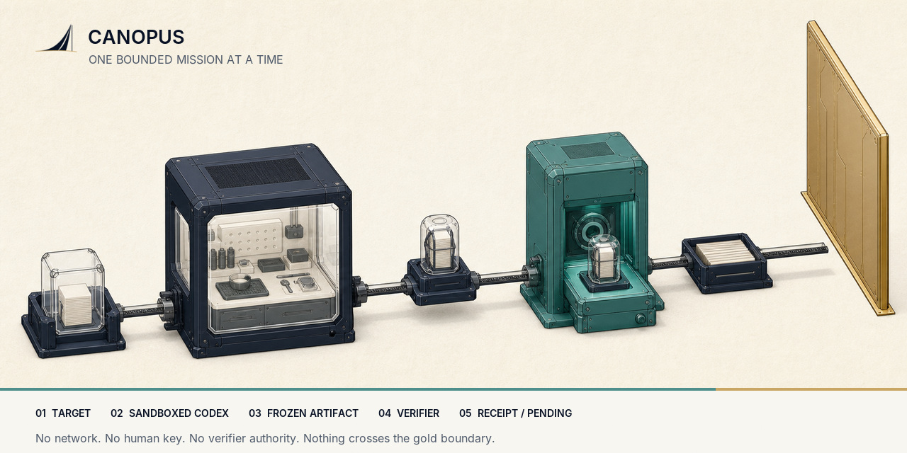

<p align="center">
  
</p>

<p align="center"><strong>Bounded research for Codex.</strong></p>

<p align="center">
  Give Codex one finite mission. Verify the artifact independently. Keep humans in authority.
</p>

<p align="center">
  <a href="https://www.npmjs.com/package/@vela-science/canopus"></a>
  <a href="https://github.com/vela-science/vela-research-harness/actions/workflows/ci.yml"></a>
  <a href="LICENSE-APACHE"></a>
</p>

<p align="center">
  <a href="https://app.vela.space/frontiers/sidon-sets/runs/run_f68e4cfc-e5c7-4c73-86cb-d79807c47ec4">Retained Sidon run</a> ·
  <a href="BUILD_WEEK.md">Build Week record</a> ·
  <a href="docs/MISSIONS.md">Missions</a> ·
  <a href="docs/RUN_RECORD.md">Run records</a> ·
  <a href="https://github.com/vela-science/vela">Vela</a>
</p>

Canopus is a removable producer over released Vela and Git. It gives Codex one
exact work offer, freezes the result, runs a separate verifier, and can land a
Receipt through `vela land`.

It cannot sign, accept a proposal, or make a scientific decision. Removing
Canopus does not change accepted state or Vela replay.

## Where Canopus fits

The Vela product story has five steps:

1. **Produce:** any suitable workbench may produce bounded work; Canopus is the
   optional isolated producer for Codex.
2. **Preserve:** the canonical frontier Git repository preserves the exact
   source, artifacts, and history.
3. **Check:** Vela replays the frontier and frozen verifiers fail closed.
4. **Decide:** signed policy or one protected human decision determines
   scientific standing.
5. **Reuse:** the read-only Observatory and other replaceable readers help
   people inspect, reproduce, and continue the work.

Canopus owns **Produce** only. It reuses Git for preservation and Vela for
checking, landing, replay, and authority; it does not become a second state
store, verifier authority, or scientific workbench platform.

## Inspect one retained example

**20 seconds — inspect the real result:** open the anonymous
[retained Sidon run](https://app.vela.space/frontiers/sidon-sets/runs/run_f68e4cfc-e5c7-4c73-86cb-d79807c47ec4)
and follow
Mission → GPT-5.6 → artifact → verifier → Receipt → Defer.

**90 seconds — inspect the shipped product:**

```sh
bunx @vela-science/canopus@0.6.3 --version
bunx @vela-science/canopus@0.6.3 profile validate sidon-a24-at-least-7194-gpt56-v3
```

**Full workflow — reproduce without rebuilding Canopus:**

Install the provenance-checked prebuilt
[Vela 0.912.0 release](https://github.com/vela-science/vela/releases/tag/v0.912.0)
for your platform, then:

```sh
git clone https://github.com/vela-science/sidon-frontier.git
cd sidon-frontier
git checkout 825657d7e87618c0aa6fc9af7e3182e05f324750
vela reproduce artifacts/sidon-a24-gpt56-7194.witness.json
node verification/verify-sidon-a24-7194.mjs \
  artifacts/sidon-a24-gpt56-7194.witness.json
```

The first command selects the pending artifact explicitly and runs Vela's
frozen Sidon verifier. The second is an independent base-3 implementation that
also rejects a bound collision injection. Neither command accepts the proposal.

## Quickstart

Run the provenance-backed public package with Bun:

```sh
bunx @vela-science/canopus@0.6.3 --version
```

Inspect a clean frontier, then run its first ranked producer offer:

```sh
bunx @vela-science/canopus@0.6.3 doctor /path/to/frontier
bunx @vela-science/canopus@0.6.3 run /path/to/frontier --first
bunx @vela-science/canopus@0.6.3 inspect latest
bunx @vela-science/canopus@0.6.3 replay /path/to/run.json
```

Export a completed Defer run without publishing or mutating anything:

```sh
canopus publish-run /path/to/run.json --mission /path/to/mission.json \
  --repository https://github.com/vela-science/<frontier> \
  --output ./public-evidence
```

The new directory contains `public-run.json`, `root-manifest.json`, exact
pending-state commands, and a read-only Observatory import descriptor. Run v1
separates worker observations, verifier observations, and caveats that remain
standing after verification; historical run v0 records remain inspectable.

Use `--no-land` for a diagnostic mission that cannot change the source frontier:

```sh
bunx @vela-science/canopus@0.6.3 run /path/to/frontier --first --no-land
```

`doctor` binds the exact Vela, Codex, Git, frontier, packet, profile, and verifier
roots. `run` refuses dirty frontiers, drifted roots, missing capsules, and
unregistered targets. It never silently skips the first ranked offer.

## Custody and authority

| Surface | Can do | Cannot do |
| --- | --- | --- |
| Codex worker | Use tools inside one bounded workspace | Reach the network, host home, human keys, or verifier |
| Verifier | Read frozen candidate bytes and declared inputs | Write, use the network, or make an authority decision |
| Canopus | Preserve evidence, replay, land a Receipt, withdraw its own proposal | Sign, accept, reject, or call verifier success acceptance |

The worker uses macOS Seatbelt or Codex's Bubblewrap sandbox on Linux and WSL2.
The verifier runs in a separate pinned container with network and writes denied.

## Everyday commands

```sh
canopus doctor [frontier]
canopus run [frontier] [--first | --target <id>] [--profile <name>] [--no-land]
canopus inspect [run.json | latest]
canopus replay <run.json>
```

Advanced profile and withdrawal commands are documented in
[Missions](docs/MISSIONS.md). Installed profiles are closed,
content-addressed contracts that bind the target, packet, objective, artifact
types, worker, verifier, replay command, budgets, and landing ceiling.

## Retained Build Week evidence

Inspect the retained Mission → worker → artifact → verifier → Receipt → Defer
chain on the [exact Sidon run](https://app.vela.space/frontiers/sidon-sets/runs/run_f68e4cfc-e5c7-4c73-86cb-d79807c47ec4).
Exact commits, run roots, audit evidence, and nonclaims live in
[`BUILD_WEEK.md`](BUILD_WEEK.md).

## Development

Requires Bun 1.3.12, Vela 0.914.0, Codex CLI 0.145.0, and Docker. The built
package also runs under Node 22 or 24; unsupported odd-numbered Node releases
are rejected rather than silently treated as supported.

```sh
bun install --frozen-lockfile
bun run check
bun run pack:check
```

## Documentation

- [Missions and profiles](docs/MISSIONS.md)
- [Run records and publication](docs/RUN_RECORD.md)
- [Release evidence](docs/RELEASES.md)
- [Why the harness stays removable](docs/adr/0001-harness-boundary-and-name.md)

## License

Apache-2.0 OR MIT, at your option. Canopus is a replaceable producer; Vela
remains the protocol and authority boundary.

The published CLI has no runtime npm dependencies. See
[Third-party components](THIRD_PARTY.md) for the bundled verifier and external
toolchain boundary.
