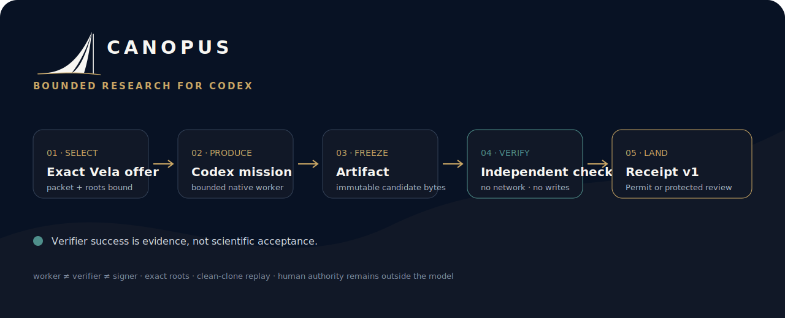

<p align="center">
  
</p>

<p align="center"><strong>Bounded research for Codex.</strong></p>

<p align="center">
  Give Codex one finite mission. Verify the artifact independently. Keep humans in authority.
</p>

<p align="center">
  <a href="https://www.npmjs.com/package/@vela-science/canopus"></a>
  <a href="https://github.com/vela-science/vela-research-harness/actions/workflows/ci.yml"></a>
  <a href="LICENSE-APACHE"></a>
</p>

<p align="center">
  <a href="https://app.vela.space/build-week">Live evidence</a> ·
  <a href="BUILD_WEEK.md">Build Week record</a> ·
  <a href="docs/MISSIONS.md">Missions</a> ·
  <a href="docs/RUN_RECORD.md">Run records</a> ·
  <a href="https://github.com/vela-science/vela">Vela</a>
</p>

Canopus is a removable producer over released Vela and Git interfaces. It
selects an exact work offer, gives a tool-enabled Codex worker a bounded mission,
freezes the output, runs a separate verifier, and can land a Receipt through
`vela land`.

Canopus cannot sign, accept a proposal, or make a scientific decision. A
verifier-passing result remains `Deferred` or `pending_review` unless an exact
signed Vela policy already permits that result class. Removing Canopus does not
change accepted state or Vela replay.

## Quickstart

Install the provenance-backed public package:

```sh
npm install --global @vela-science/canopus@0.4.5
canopus --version
```

Inspect a clean frontier, then run its first ranked producer offer:

```sh
canopus doctor /path/to/frontier
canopus run /path/to/frontier --first
canopus inspect latest
canopus replay /path/to/run.json
```

Use `--no-land` for a diagnostic mission that cannot change the source frontier:

```sh
canopus run /path/to/frontier --first --no-land
```

`doctor` binds the exact Vela, Codex, Git, container, frontier, packet, profile,
and verifier roots before work begins. `run` refuses dirty frontiers, drifted
binaries or roots, missing capsules, cloud-synced outputs, and unregistered
targets. It never silently skips the first ranked offer.

## What one run does

1. Reads the first exact producer offer from released Vela.
2. Validates a closed, content-addressed Canopus profile.
3. Copies the source into a fresh bounded worker workspace.
4. Runs Codex with browser, network, MCP, apps, delegation, human keys, and
   unrelated repositories outside the worker boundary.
5. Freezes the candidate bytes and ends the producer phase.
6. Runs a separate network-denied, write-denied verifier capsule.
7. Reproduces the result from a clean clone.
8. Optionally lands one Receipt through Vela; Canopus never signs it as a human.

## Custody and authority

| Surface | Allowed | Forbidden |
| --- | --- | --- |
| Codex worker | Shell and patch tools inside the bounded mission workspace | Network, browser, MCP, host home, human keys, verifier oracle |
| Verifier | Read the frozen candidate and declared inputs | Network, writes, producer interaction, authority decisions |
| Canopus | Select work, preserve evidence, invoke `vela land`, replay, withdraw its own proposal | Sign, accept, reject, claim verifier success is acceptance |
| Vela | Validate roots, Receipt, policy context, replay, and standing | Delegate protected human authority to Canopus or a model |

The worker uses macOS Seatbelt or Codex's Bubblewrap sandbox on Linux/WSL2.
Native Windows supports the read-only product surface and hands tool-using
missions to WSL2. A platform that cannot pass the hostile custody fixture is
unsupported rather than silently weakened.

The verifier runs in its own pinned multi-architecture container with network
and writes denied. The producer cannot invoke it as an authority oracle.

## Product commands

```sh
canopus doctor [frontier]
canopus run [frontier] [--first | --target <id>] [--profile <name>] [--no-land]
canopus inspect [run.json | latest]
canopus replay <run.json>
canopus withdraw [frontier] [--run <run.json|latest>] --reason <text>
```

After a pending landing reproduces, Canopus may retain only the exact
Receipt-bound producer capability needed to withdraw that one proposal. It is
never mounted into the worker or verifier, never enters run evidence, and is
deleted after withdrawal or a terminal human decision.

## Profiles

Installed releases contain only active, closed `canopus.profile.v2` contracts.
Each profile binds a target and packet, bounded objective, allowed artifacts,
worker platform, verifier image, replay command, budgets, and landing ceiling.

```sh
canopus profile list
canopus profile show <profile>
canopus profile validate <profile>
canopus profile pack <profile> --output /new/profile-pack
```

Current active profiles:

- `erdos1056-k15-10428401-10428600`
- `formal-erdos-505-test-dim-one-gpt56`

Mission v1 remains the advanced portable bundle format. Mission v0, stopped
cold-use registrations, and retired benchmark implementations remain available
in Git and release evidence, but are intentionally absent from ordinary help
and the installed package.

## OpenAI Build Week

For a fast public inspection:

1. Open the [live evidence surface](https://app.vela.space/build-week) to inspect
   the retained Mission → worker → artifact → verifier → Receipt → Defer chain.
2. Run `canopus profile validate formal-erdos-505-test-dim-one-gpt56` against
   the installed package.
3. Use the separate no-model `vela reproduce .` command shown on the evidence
   page to check the retained scientific artifact.

The exact commits, run roots, collaboration record, advisory audit, and
nonclaims live in [`BUILD_WEEK.md`](BUILD_WEEK.md). First-party runs demonstrate
the product contract; they do not claim independent scientific adoption.

## Development

Requires Node 22 or 24, pnpm 10, Vela 0.910.0, Codex CLI 0.144.6, and Docker.
Linux and WSL2 also require Bubblewrap and OpenAI's targeted AppArmor setup for
`bwrap-userns-restrict`. Canopus never disables the host-wide user-namespace
restriction or falls back to an unsandboxed worker.

```sh
pnpm install --frozen-lockfile
pnpm check
pnpm pack --dry-run
```

Focused hostile-boundary checks:

```sh
pnpm fixture:hostile-custody
pnpm fixture:hostile-verifier
```

## Documentation

- [Mission roles](docs/MISSIONS.md)
- [Run-record and publication semantics](docs/RUN_RECORD.md)
- [Release evidence](docs/RELEASES.md)
- [Harness boundary and deletion test](docs/adr/0001-harness-boundary-and-name.md)
- [Portable profiles and cross-platform custody](docs/adr/0006-portable-profiles-public-distribution-and-cross-platform-worker-custody.md)

## License

Apache-2.0 OR MIT, at your option. Canopus is a replaceable producer; Vela
remains the protocol and authority boundary.
